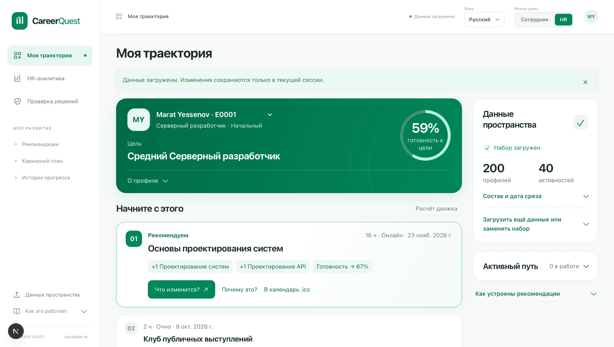

# Career Quest

**Career Quest recommends not the weakest skill, but the next best career move.**

AI-навигатор развития сотрудника: по профилю, истории участия и требованиям следующего грейда
система подбирает 1–3 шага развития, объясняет каждый минимум по трём факторам и показывает,
как сдвинется карьерная готовность — до того, как человек потратит на это время.

> HackAlem AI · трек Halyk Bank · кейс **Career Quest**
> Команда: Алихан (Intelligence), Манахнбет (Experience), Даник (Trust)

Employee, HR и Trust подключены к одной сессии приложения. Адреса `/` и `/demo`
перенаправляют в кабинет сотрудника `/employee`.



*Кабинет сотрудника. Слева — цель и готовность к ней, в карточке рекомендации видно, какие
навыки она поднимает и как сдвинется готовность, рядом — «Почему это?», «Что изменится?»
и выгрузка в календарь. Справа — состав загруженного набора и переключатели языка и режима.*

> **Что нужно, чтобы запустить.** Node 22, pnpm и две команды — `pnpm install --frozen-lockfile`
> и `pnpm dev`. Либо `docker compose up --build`. Ключи не нужны: без них работает весь
> продукт, включая рекомендации, объяснения, HR-экран и Trust Center.
>
> **Ключ нужен только для AI-слоя.** В репозитории его нет и не будет — есть только
> `.env.example` с несекретными настройками. Чтобы увидеть bounded-критика и HR-агента,
> впишите свой ключ OpenAI в `.env.local`: подробная инструкция и способ проверить, что
> ключ подхватился, — в разделе [LLM для локального запуска и проверки жюри](#llm-для-локального-запуска-и-проверки-жюри).
> Без ключа интерфейс честно показывает «Локальное объяснение · без AI» и продолжает работать.

## Почему наше решение другое

|                             |                                                                                                                                                                                 |
| --------------------------- | ------------------------------------------------------------------------------------------------------------------------------------------------------------------------------- |
| **Decision Engine**         | Многофакторный детерминированный выбор: разрыв по навыкам с приоритетом критичных, история участия, выполнимость, цель, разнообразие. Не один prompt и не «самый низкий навык». |
| **Digital Twin**            | Карьерный эффект виден **до** выполнения активности: what-if по уровням и readiness, план на несколько шагов, подтверждение с пересчётом.                                       |
| **Trust Center**            | У каждого решения есть Evidence Receipt. Баг-репорт на сам AI: нарушения eligibility, подтверждённость чисел, корректность пересчёта истории, latency, поведение без LLM.       |
| **External Learning Layer** | Отдельный офлайновый каталог проверенных внешних курсов для разрывов без внутренней активности — без выдуманного gain и без влияния на top-3/readiness.                        |
| **AI-слой**                 | Модель не источник истины, а ограниченный критик поверх готового решения, плюс агент для HR, который сам собирает ответ через инструменты над данными. Аргументы можно только процитировать из evidence — выдумать нельзя. |
| **Экономика развития**      | Баллы за добровольное развитие и помощь коллегам оплачивают внешний курс. Баланс не хранится, а выводится из данных, поэтому его всегда можно объяснить. Рейтингов сотрудников нет намеренно. |

## Быстрый старт

```bash
pnpm install --frozen-lockfile
pnpm dev
```

Открыть http://localhost:3000 и нажать **«Посмотреть демо»** для загрузки набора организаторов
или выбрать четыре файла из `data/source/`.
В общей навигации доступны «Моя траектория», «HR-аналитика» и «Проверка решений».
Две кнопки **«Сотрудник» / «HR»** в верхней панели переключают режим и открывают
соответствующий кабинет. При входе в HR-аналитику или «Проверку решений» из режима
сотрудника кнопка **«Перейти в режим HR»** переключает режим на текущей странице.
Если данные ещё не загружены, доступна кнопка **«Перейти к загрузке»**.
Переходы сохраняют импорт, выбранный профиль и завершения текущей вкладки.
Режимы демонстрируют видимость экранов; они не заменяют аутентификацию и защиту
реальных персональных данных.

**Проверочные профили.** Загрузчик определяет тип файла по содержимому, а не по имени, поэтому
принимает и `judge_profiles.json`, и набор из одного-двух файлов: недостающие части берутся из
уже открытого набора. Режим **«Дополнить»** добавляет профили к текущим, не вытесняя их, а режим
**«Заменить»** меняет набор целиком. После импорта показывается сводка — сколько профилей и
записей истории добавлено, какие строки отклонены и почему — и кнопка перехода к добавленным
профилям. Готовые примеры лежат в [`fixtures/judge/`](fixtures/judge).

Общий переключатель **«Язык»** в верхней панели меняет интерфейс, форматы чисел и дат
и язык AI-объяснений: **Қазақша (`kk`) / Русский (`ru`) / English (`en`)**.
Выбор сохраняется в браузере и восстанавливается после перезагрузки. Язык интерфейса
не зависит от `preferred_language` выбранного сотрудника: смена профиля его не меняет.

Docker — одной командой:

```bash
docker compose up --build
```

Полная инструкция с развёртыванием на сервере, проверкой и обновлением —
в разделе [Развёртывание через Docker](#развёртывание-через-docker).

**LLM-ключ не обязателен.** Без него приложение работает полностью: тот же ranking и
детерминированные объяснения. Ключ включает bounded-критика и HR-агента поверх вычисленных фактов.
Переменные — в `.env.example`.

Требуется Node 22 и pnpm (`corepack enable`).

### LLM для локального запуска и проверки жюри

В репозитории хранится только `.env.example` с несекретными настройками. Действующий
ключ каждый участник задаёт на своём компьютере; он не входит в Git и Docker-образ.

1. Скопировать `.env.example` в `.env.local` рядом с `package.json`:
   `cp .env.example .env.local` (Linux/macOS) или
   `Copy-Item .env.example .env.local` (PowerShell). Не перезаписывать уже настроенный файл.
2. Вписать действующий ключ OpenAI после `LLM_API_KEY=` и сохранить файл.
   URL `https://api.openai.com/v1` и модель `gpt-4.1-mini` уже указаны в шаблоне.
3. Запустить `pnpm dev`. Для production: `pnpm build`, затем `pnpm start`.
   После изменения окружения перезапустить сервер.
4. Для Docker: `docker compose --env-file .env.local up --build`.
   Compose передаёт ключ контейнеру при запуске, а не во время сборки образа.

Для всех копий репозитория на одном компьютере можно один раз задать `OPENAI_API_KEY`
в пользовательских переменных окружения ОС и открыть новый терминал. Тогда локальный
`.env.local` необязателен: все AI routes используют ключ из окружения и настройки OpenAI
по умолчанию. `LLM_API_KEY`, если непустой, имеет приоритет над `OPENAI_API_KEY`.
Docker Compose также передаёт эти переменные из запускающего терминала.
Для другого OpenAI-compatible провайдера обязательно задать его `LLM_BASE_URL` и `LLM_MODEL`.

Проверка жюри:

- Открыть `/api/ai/agent`: `{"status":"available"}` подтверждает наличие настроек,
  но ещё не проверяет доступ к API или баланс.
- Загрузить демо, перейти в режим HR, открыть `/hr` и отправить вопрос в панели агента.
  Успешный ответ с вычисленными evidence и пройденной проверкой подтверждает весь сценарий.
- Ошибки доступа, лимита, сети или проверки фактов остаются видимыми; они не выдаются за
  успешный LLM-ответ. Детерминированная аналитика продолжает работать без модели.

У HR-агента отдельный `LLM_AGENT_TIMEOUT_MS=10000`; bounded-критик сохраняет
`LLM_TIMEOUT_MS=2500` и верхнюю границу 3000 мс.

Фактическая проверка OpenAI 2026-09-23 (без данных сотрудников и без вывода ключа):

```json
{"http_status":200,"model":"gpt-4.1-mini-2025-04-14","reply":"OK","total_tokens":13}
```

Это подтверждает доступ проверенного локального ключа на момент проверки. Чистый clone
не содержит ключ: для live-демо на компьютере жюри нужен отдельно настроенный ключ.

## Развёртывание через Docker

Требования: Git, Docker, Docker Compose v2 и доступ к интернету.

### 1. Скачать проект

```bash
git clone https://github.com/BAITC-Hacks/hack-7de27e4a-ai-solutions.git
cd hack-7de27e4a-ai-solutions
```

### 2. Настроить LLM

Скопировать шаблон окружения:

```bash
cp .env.example .env.local
```

Заполнить `.env.local`:

```env
LLM_API_KEY=YOUR_OPENAI_API_KEY
LLM_BASE_URL=https://api.openai.com/v1
LLM_MODEL=gpt-4.1-mini
LLM_TIMEOUT_MS=2500
LLM_AGENT_TIMEOUT_MS=10000
```

Вместо `YOUR_OPENAI_API_KEY` указать действующий ключ OpenAI. `.env.local` в Git не добавляется —
он уже в `.gitignore`.

**Шаг необязательный.** Без ключа рекомендации и аналитика работают в детерминированном режиме,
отключается только LLM-слой.

### 3. Запустить приложение

```bash
docker compose --env-file .env.local up -d --build
```

Открыть http://localhost:3000. Без `.env.local` достаточно `docker compose up -d --build`.

На удалённом сервере приложение доступно по адресу `http://<IP-сервера>:3000`, если порт открыт.
Для домена настроить reverse proxy с HTTPS на порт 3000.

### 4. Проверить запуск

```bash
docker compose --env-file .env.local ps
docker compose --env-file .env.local logs --tail=100 app
curl http://localhost:3000/api/ai/agent
```

Ответ `{"status":"available"}` подтверждает наличие настроек LLM, но не проверяет сам ключ
и баланс. Без ключа маршрут честно отвечает `{"status":"no_key"}`. Для полной проверки
загрузить демо, открыть HR-дашборд и задать вопрос агенту.

### 5. Обновить проект

```bash
git pull --ff-only origin main
docker compose --env-file .env.local up -d --build
```

После изменения `.env.local` повторить команду запуска.

> Загруженные данные и изменения хранятся в памяти вкладки: после перезагрузки страницы
> набор нужно загрузить заново. Если порт 3000 занят локальным `pnpm dev`, Compose не
> стартует — остановите dev-сервер или смените порт в `docker-compose.yml`.

## Демо-сценарий

После импорта выбрать E0028: System Design после replay равен 3, EV_006 повторно
не предлагается. Примерить и подтвердить Leadership Foundations: readiness 74% → 78%.
Открыть HR: число добровольных завершений увеличится с 1044 до 1045. Открыть Trust и
запустить проверки; затем вернуться к сотруднику — профиль и журнал сохранятся.
Показать External Learning Layer: внешние курсы появляются только там, где нет подходящей
внутренней активности, и не обещают числовой рост навыка.

Полный скрипт: [`docs/DEMO.md`](docs/DEMO.md).

## Архитектура

Next.js + TypeScript. Согласованный интерфейс на RU/KK/EN использует
`AppProviders` и один `sharedEmployeeStore`: импорт, выбранный профиль и журнал
подтверждений находятся в памяти вкладки. Employee, HR и Trust читают эту общую сессию.

```
Import (Zod) -> NormalizedDataset -> history replay -> target gaps
   -> hard filters -> multi-factor ranking -> Evidence Receipt
        ├─> Employee Digital Twin (what-if, planner, ledger)
        ├─> HR Command Center (агрегаты, no-step alerts)
        ├─> AI Trust Center (baseline, evals, fallback)
        └─> External Learning Layer (offline, read-only, outside scoring)
```

Для объяснений текущий UI обращается к `/api/ai/explain`: передаёт язык интерфейса
и ограниченные числовые evidence-факты по кандидатам, включая импортированные наборы.
Сохранённый `/api/ai/review` принимает только ID и восстанавливает evidence на сервере
из встроенного набора. Контракты этих endpoints различаются.

Из `main cf1dc89` сохранены новые доменные модули и API. Альтернативные
`CareerQuestStore`, IndexedDB, private Employee projection и XP-модуль не подключены
к активным страницам; текущий интерфейс не обещает эти возможности.

### External Learning Layer

`data/external_courses.json` — курируемый офлайновый каталог из 35 внешних курсов. При
запуске нет запросов к API провайдеров: ссылки и skill IDs проверяются локальной строгой
Zod-схемой, разрешены только HTTPS-домены из allowlist. Курс показывается отдельно и только
когда ни одна внутренняя активность не закрывает конкретный разрыв сотрудника.

Внешние курсы намеренно не входят в `NormalizedDataset`, recommendation ranking, top-3,
readiness, what-if или completion ledger: у них нет подтверждённых компанией `gain` и
`max_level`. Поэтому UI не показывает числовой эффект и честно маркирует источник. На
текущем bundled snapshot движок вычисляет **88 сотрудников** с критичным hard-skill
блокером без подходящей внутренней активности; HR-экран пересчитывает показатель для
фактически загруженного набора данных, а не использует хардкод.

Подробно: [`docs/ARCHITECTURE.md`](docs/ARCHITECTURE.md) · контракты:
[`docs/CONTRACTS.md`](docs/CONTRACTS.md) · данные: [`docs/DATASET.md`](docs/DATASET.md).

## Как считается рекомендация

Перед любым расчётом движок **доигрывает историю**: уровни в профиле актуальны на
`last_review_date`, а всё завершённое позже ещё не учтено. В стартовом наборе это 318 записей
у 114 из 200 сотрудников — то есть решение без replay ошибается на каждом втором профиле.

Hard-фильтры (до скоринга): mandatory, несоответствие роли/грейду, невыполненные
prerequisites, уже пройденное (кроме recurring `EV_036`), нулевой effective gain, отсутствие
будущей сессии.

Ранжирование:

| Фактор                                      | Вес |
| ------------------------------------------- | --- |
| Target gap impact (critical skills ×2)      | 45% |
| Engagement fit (история, self vs assigned)  | 20% |
| Feasibility (prerequisites, формат, сессия) | 15% |
| Goal alignment (в т.ч. cross-role цели)     | 10% |
| Path / diversity                            | 10% |

`effective_gain = max(0, min(current + gain, max_level, 5) - current)` — правило роста задано
самим датасетом, не придумано нами.

## Результаты проверки

Прогон на текущем `main` (2026-09-23):

| Команда | Результат |
| --- | --- |
| `pnpm test` | **283 теста в 31 файле, все зелёные** |
| `pnpm typecheck` | без ошибок |
| `pnpm build` | production-сборка успешна, 10 маршрутов |

Проверено на Node 22 и pnpm 11 из чистой установки `pnpm install --frozen-lockfile`.

Браузерная проверка на production-сборке: демо-набор загружается одной кнопкой,
профили жюри импортируются по содержимому файла, подтверждение активности
пересчитывает траекторию, HR и Trust читают то же состояние, интерфейс работает
на трёх языках, и весь сценарий проходит без ключа LLM.

> **CI.** GitHub Actions в этом репозитории не запускается: аккаунт организации
> заблокирован по биллингу, и джоба падает до старта раннера (`steps: []`, 2 секунды).
> Это не состояние кода. Workflow переведён на ручной запуск, чтобы не создавать
> ложных красных отметок; воспроизводимость подтверждается командами выше.

> **Windows.** На части конфигураций Windows `vitest` и `next build` падают с
> `spawn EPERM` на этапе загрузки конфига — это ограничение окружения, а не проекта.
> Проверяйте на macOS/Linux или в Docker.

Метрики и adversarial-кейсы: [`docs/EVALUATION.md`](docs/EVALUATION.md).
История интеграционных прогонов: [`docs/INTEGRATION.md`](docs/INTEGRATION.md).

## Приватность и отказоустойчивость

- Исходные импортированные файлы и полная история остаются в браузере; серверной БД нет.
- В LLM уходят только evidence-факты по top-кандидатам — **никогда** raw-профиль и история.
- Ответ модели проходит Zod-схему и fact verifier: неизвестный ID, изменённое число или
  неподтверждённое утверждение блокируются.
- Текст из датасета трактуется как данные, а не как инструкции (защита от prompt injection).
- Без ключа или при ошибке модели — полноценный детерминированный режим.
- `/api/ai/explain` проверяет ответ относительно присланного evidence; происхождение
  импортированных фактов сервером не подтверждается. `/api/ai/review` использует
  серверный встроенный набор. Оба route ограничивают origin, JSON, размер тела и частоту запросов.
- Режимы просмотра сотрудник / HR для демонстрации; публичных рейтингов сотрудников нет.
- Названия внешних курсов трактуются как данные и не передаются в LLM; ссылки разрешены
  только по HTTPS allowlist и открываются с `noopener noreferrer`.

## Ограничения

- Набор и прогресс хранятся в памяти вкладки. Полная перезагрузка страницы сбрасывает сессию.
- Режим демо не заменяет серверную авторизацию; приложение предназначено для синтетического набора.
- Beam search ограничен шириной 10 и глубиной 4; календарная совместимость активностей не рассчитывается.
- Живой платный LLM-провайдер не вызывался при проверке; протестированы проверенные ответы, отказ,
  таймаут и режим без ключа. AI не меняет порядок рекомендаций.
- Docker image собран локально; отдельный HTTP smoke уже внутри запущенного контейнера в этом
  прогоне не выполнялся — Employee и HR проверены на локальной production-сборке.

## Документация

| Файл                                           | О чём                                         |
| ---------------------------------------------- | --------------------------------------------- |
| [`docs/ARCHITECTURE.md`](docs/ARCHITECTURE.md) | Техническая модель, формула, release gates    |
| [`docs/DATASET.md`](docs/DATASET.md)           | Проверенные факты о данных и доменные правила |
| [`docs/CONTRACTS.md`](docs/CONTRACTS.md)       | Общие типы и публичный API ядра               |
| [`docs/PLAYBOOK.md`](docs/PLAYBOOK.md)         | План на 5 часов, feature gates, checklist     |
| [`docs/WORKSTREAMS.md`](docs/WORKSTREAMS.md)   | Готовые Codex-задания по потокам              |
| [`docs/EVALUATION.md`](docs/EVALUATION.md)     | Метрики и adversarial-кейсы                   |
| [`docs/DEMO.md`](docs/DEMO.md)                 | Демо-скрипт на 90 секунд                      |
| [`AGENTS.md`](AGENTS.md)                       | Правила для AI-агентов                        |
| [`CONTRIBUTING.md`](CONTRIBUTING.md)           | Ветки, коммиты, merge, handshake              |
| [`docs/INTEGRATION.md`](docs/INTEGRATION.md)   | История интеграционных прогонов               |
| [`docs/DECISIONS.md`](docs/DECISIONS.md)       | Журнал принятых решений                       |
| [`docs/ADVANCED_FEATURES.md`](docs/ADVANCED_FEATURES.md) | Задания на продвинутые фичи         |
| [`docs/tz/`](docs/tz)                          | Персональные ТЗ и спецификации фич            |

---

Данные синтетические, предоставлены организаторами. Реальные персональные данные не
используются.
